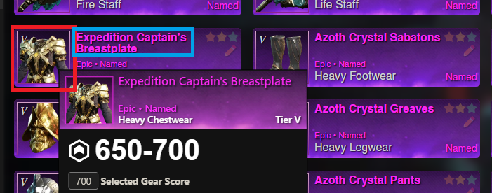

# Core concepts

## Show everything

From the browsable datasheets, no data is excluded. Meaning, buddy shows more than what is available in the game including playtest data.

However, per default not all columns are displayed for performance and readability reasons. Any column can be enabled from the table menu.

## Show raw data

While in some sections buddy tries to present data as pretty as possible, some sections intentionally display raw data for the user to digest and reason about.

## Link to NWDB

NWDB is the most complete and accurate database and the place to go for details that are coherent with ingame rules. Wherever possible buddy tries to place two links

* one internal, for further exploration on nw-buddy.de
* one external, for further exploration on nwdb.info

For example all icons in a table view show the nwdb tooltip and link to that item on nwdb.

<figure><figcaption>
Icon with nwdb tooltip that links to nwdb.info
</figcaption></figure>

Item headers have same concept. The icon leads to nwdb, while the title has the internal link.

<figure><figcaption>
Icon with nwdb tooltip and title with internal link
</figcaption></figure>

## Keep it serverless

Well, kind of. All website data is served from static files, there is no further server side logic. Whole magic happens inside the application in the browser.&#x20;

While it makes the development process easiert it also makes the website heavy. Clicking through all tables easily lets the browser download 20mb on compressed JSON files which is 200mb uncompressed in memory.

## Data storage

All user data (gearsets, itemtracking etc.) is kept locally in the browser. No user data is sent to the server and can not be restored on loss.

Be aware that clearing the browser cache also clears your data for buddy. To prevent data loss, please export and backup your data from time. &#x20;

