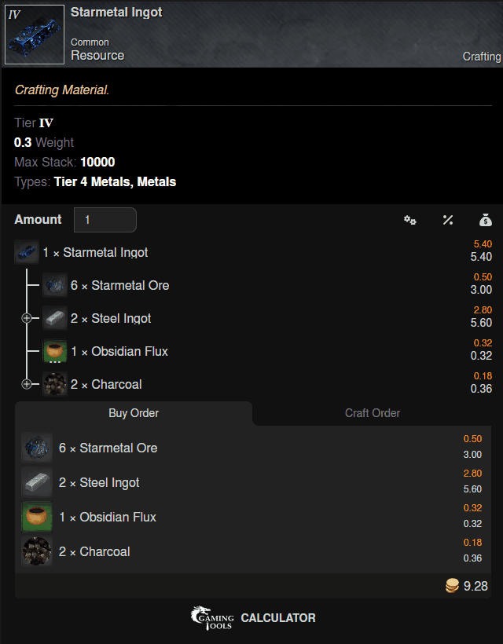
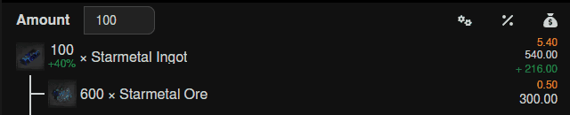
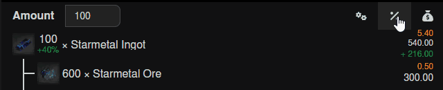
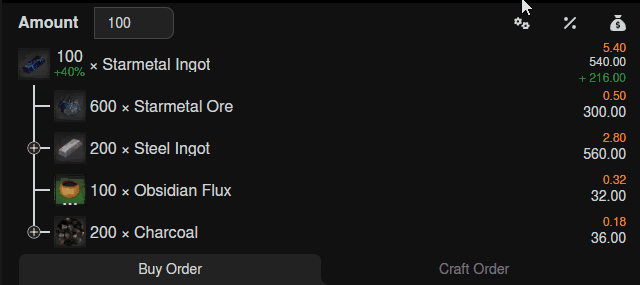

# Crafting Calculator

<figure><figcaption></figcaption></figure>

## Price Input

Prices can be imported from [https://nwmarketprices.com/](https://nwmarketprices.com/) or from raw JSON files or manually adjusted in for each row.

<figure><figcaption></figcaption></figure>

## Bonus Chance

In this example the craft bonus chance is 40%, meaning after 100 crafted items we may end up with roughly 140 total items.

With the "net/gross" mode button we can switch into the mode where bonus chance is used to reach the goal of 100 items without overshoot.

<figure><figcaption>
Bonus percent
</figcaption></figure>

To increase the bonus chance, profession gear can be chosen from the settings menu

<figure><figcaption></figcaption></figure>

### Buy Order Tab

The outermost leafs of the crafting tree are the resources that are needed to perform the craft. Those are summarized in the buy order tab.

<figure><figcaption></figcaption></figure>

### Craft Order Tab

The root element and the expanded nodes are the items that require a craft session. For those profession XP is gained. That is summarized in the craft order tab.

<figure><figcaption></figcaption></figure>
