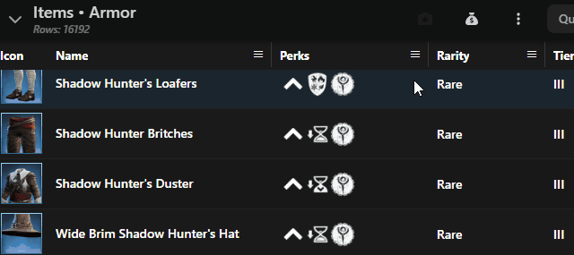
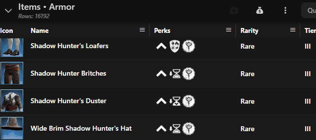
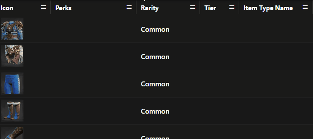
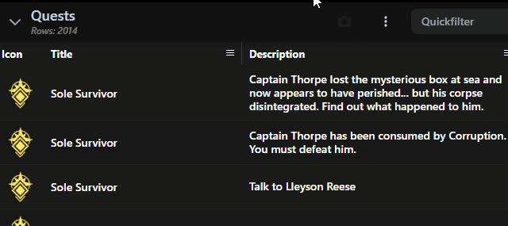
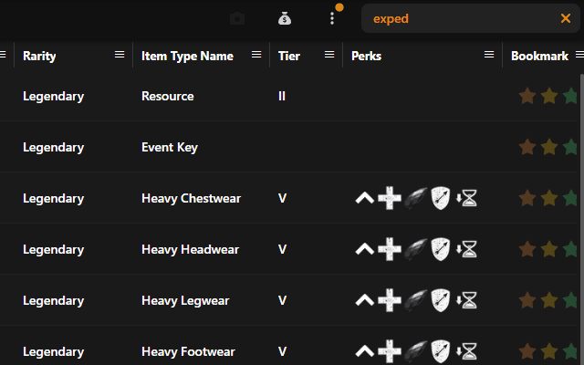
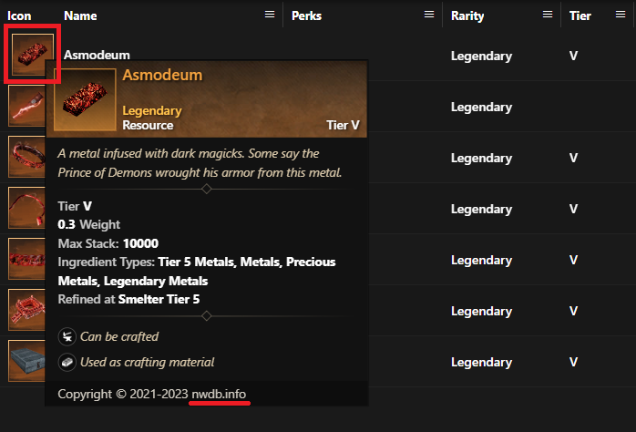

# Data panel

## Change column order

<figure><figcaption></figcaption></figure>

## Sort by column

To sort a column click the column header. If the column supports sorting, it will sort.&#x20;

<figure><figcaption></figcaption></figure>

## Column filter

Columns have different filter abilities. Some have just a simple text or number filter, some provide a more complex filter which allows to enter multiple conditions.

<figure><figcaption></figcaption></figure>

## Column show/ hide

Use the dropdwon panel to enable ordisable available table columns

<figure><figcaption></figcaption></figure>

## Reset column & filter state

After a session, the table may end up with multiple filters set and columns reordered.

To reset these, use the drop-down menu and reset either the filter or the column state, or both.

<figure><figcaption></figcaption></figure>

The column state needs to be reset from time to time, as the state is persisted and restored across browsing sessions. When new columns are introduced, they may not appear until they are either manually enabled or the state is reset.

## Link to NWDB

The icon column always links to NWDB when an nwdb tooltip is shown

<figure><figcaption></figcaption></figure>

## Bookmarking

Bookmarks can be placed on any item. Filter by any bookmark or combination is possible. Bookmarked items appear as "tracked" in their [tracking category](../tracking.md)

<figure><figcaption></figcaption></figure>
