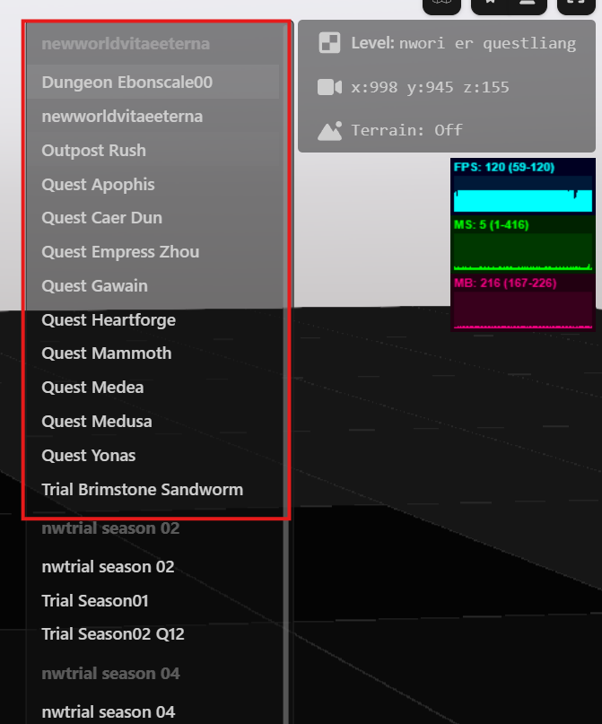
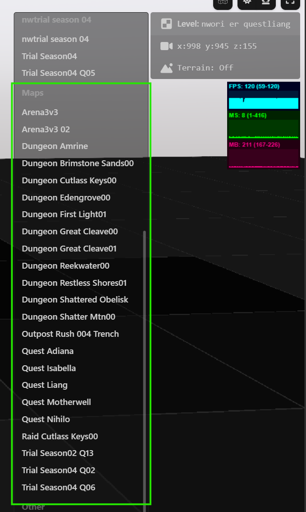

# How to load levels

## TLDR;

Open powershell and checkout the repository
```
git clone git@github.com:giniedp/nw-buddy.git
cd nw-buddy
```

Copy `.env.example` to `.env`. 
```
copy .env.example .env
```
Edit the `.env` and point the `NW_GAME_LIVE` variable to your installation directory of new world

Run the `nwbt serve` command
```
./tools/bin/nwbt serve --texture-size 1024
```
- visit https://www.nw-buddy.de/levels to browse and preview new world levels
- visit https://www.nw-buddy.de/pak to browse pak files
- mention the `--texture-size 1024` argument, don't leave it out or performance goes to hell

## Prerequirements
You need the `nwbt.exe` or be able to run `nwbt` from source.
In both cases you have to

- be familiar with running commands from terminal
- clone the source code
- prepare a `.env` file

When running `nwbt.exe` directly, you don't need any further setup. 
When running from source, see the requirements in the project readme.

### Clone the source

```
git clone git@github.com:giniedp/nw-buddy.git
cd nw-buddy
```

### Create the .env file

- In project root directory, copy the `.env.example` to `.env`. 
- Edit the `.env` and adjust the `NW_GAME_LIVE` variable so that it points to your installation of new world

Mention the (disabled) variables at the bottom of the file. You can adjust the behavior of the `nwbt` and its file server if you need to. Leave them disabled for now until you have a reason to change.

### Running nwbt

The following commands are tested in powershell but should also run in windows terminal. The exampels use forward slashes `/`. If you use windows terminal, you might need to use (double) backslahes instead.

#### Running nwbt.exe directly
- Open powershell and `cd` into nw-buddy root directory
- Run `./tools/bin/nwbt`

#### Running nwbt from source

- Setup all project dev dependencies as described in the main readme
- Run `pnpm nwbt`

This should list the availabe `nwbt` subcommands

```
███╗   ██╗██╗    ██╗    ██████╗ ██╗   ██╗██████╗ ██████╗ ██╗   ██╗
████╗  ██║██║    ██║    ██╔══██╗██║   ██║██╔══██╗██╔══██╗╚██╗ ██╔╝
██╔██╗ ██║██║ █╗ ██║    ██████╔╝██║   ██║██║  ██║██║  ██║ ╚████╔╝
██║╚██╗██║██║███╗██║    ██╔══██╗██║   ██║██║  ██║██║  ██║  ╚██╔╝
██║ ╚████║╚███╔███╔╝    ██████╔╝╚██████╔╝██████╔╝██████╔╝   ██║
╚═╝  ╚═══╝ ╚══╝╚══╝     ╚═════╝  ╚═════╝ ╚═════╝ ╚═════╝    ╚═╝

Usage:
  nwb [command]

Available Commands:
  cache       shows cache and temp directory stats
  cat         concatenate files and print on the standard output
  help        Help about any command
  list        lists the file names
  models      converts game models to .gltf or .glb format
  pull        pulls data from .pak files specifically for nw-buddy purposes.
  types       scans game assets and other sources for runtime type information and generates code.
  unpack      unpacks game data with optional preprocessing (e.g. object-stream to json or image conversion).
  vet         runs various checks

Flags:
  -h, --help      help for nwb
  -v, --version   version for nwb
```

#### vet command
Mainly checks if the `.pak` files are accessible. If they're not, check the `.env` and fix your game path at `NW_GAME_LIVE`
```
PS E:\nw-buddy> ./tools/bin/nwbt vet
17:27:02 INF [ENV] loaded .env file
17:27:02 INF [ENV]  workspace: LIVE
17:27:02 INF [ENV]   game dir: C:/Program Files (x86)/Steam/steamapps/common/New World
17:27:02 INF [ENV]   temp dir: E:/nw-buddy/.nwbt/temp
17:27:02 INF [ENV] unpack dir: E:/nw-buddy/.nwbt/unpack
17:27:02 INF [ENV]  cache dir: E:/nw-buddy/.nwbt/cache
17:27:02 INF [ENV]   pull dir: E:/nw-buddy/dist/nw-data/live
17:27:02 INF Texconv    found at path=E:\nw-buddy\tools\bin\texconv.exe
17:27:02 INF Cwebp      found at path=E:\nw-buddy\tools\bin\cwebp.exe
17:27:02 INF NVTT       found at path="C:\\Program Files\\NVIDIA Corporation\\NVIDIA Texture Tools\\nvtt_export.exe"
17:27:02 INF Oodle      found at path=E:\nw-buddy\tools\bin\oo2core_9_win64.dll
17:27:02 INF Image Magick found at path="C:\\Program Files\\ImageMagick-7.1.1-Q16-HDRI\\magick.exe"
17:27:02 INF ktx        found at path="C:\\Program Files\\KTX-Software\\bin\\ktx.exe"
     Loading archive [==============================] 100% 125/125 00:01 125 paks 1178744 files
17:27:05 INF No duplicate file paths in pak files
```

#### serve command

This will start the actual file server.

```
PS E:\nw-buddy> ./tools/bin/nwbt serve --texture-size 1024
     Loading archive [==============================] 100% 125/125 00:01 125 paks 1178744 files
     Loading catalog [------------------------------]   0% 0/0 00:01
19:39:27 INF serving on address=localhost:8000
```

Noteworthy things about the server:

- Always prefert adding the `--texture-size 1024` argument to limit the output texture size.
- Runs at `http://localhost:8000` if you haven't changes that in the `.env`
- Reads the `.pak` archives and serves the requested files. Transforms files to requested format (dds -> png) on the fly
- Expensive transformations like images and 3d models are cached at `.nwbt/cache`. This will eat some gigabytes over time. 
- nw-buddy tries to access http://localhost:8000 when you visit following routes
  - https://www.nw-buddy.de/levels
  - https://www.nw-buddy.de/pak

### View levels
When `nwbt serve` is running, visit https://www.nw-buddy.de/levels
This will load a default level and allow you to browse into other levels

Controls

- W, A, S, D for camera movement. Q, E for elevation.
- Left click + mouse move turns the camera.
- Mouse wheel adjusts the camera speed.

Avoid loading the open world levels, unless you really want to. But expect the browser to crash. The viewer is not optimized to handle a large open world scene. This is WIP



Other levels, especially the dungeons should be safe to load.



Loading is very slow, especially on first load since the assets are converted on the fly and must undergo a compute intensive pipeline.
