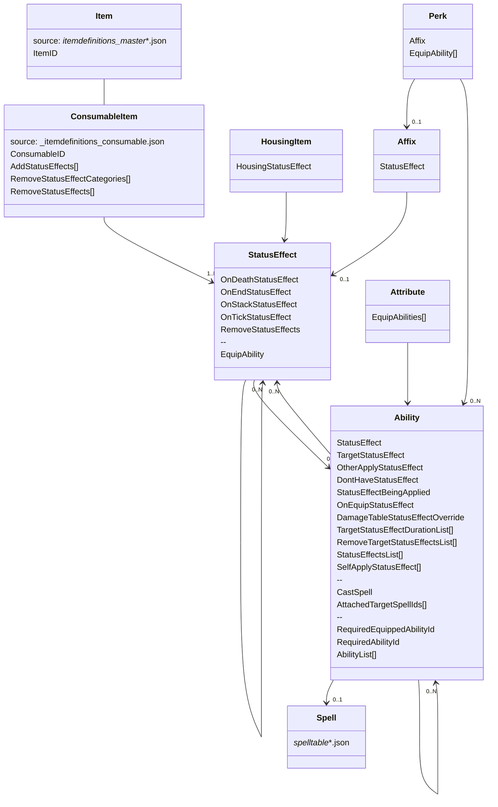

# Data table relations



# Player HP

$BaseHP + LevelHP + ConstHP$

where

- `BaseHP` = $778$ from `vitals.json` (VitalsID=Player)
- `LevelHP` = $1.5 * (Level - 1)^2$
- `ConstHP` = lookup by level from `javelindata_attributeconstitution.json`

See [Spreadsheet](https://docs.google.com/spreadsheets/d/1z914znwnL403tup6MApU9mnyWuycOhoPp0NNWQJODUg) for used data.

## Health modifiers

### `MaxHealthMod` from Hale and Hearty

add `MaxHealthMod * (BaseHP + LevelHP)`

### `MaxHealth` from amulet perk

add `MaxHealth * (BaseHP + LevelHP + ConstHP)`

### `PhysicalArmorMaxHealthMod` from 100 const bonus

add `PhysicalArmorMaxHealthMod * physicalRating * (1 + physicalBonus)`

where
- `physicalRating` sum of physical rating from equpped armor and weapon
- `physicalBonus` sum of all actve `PhysicalArmor` modifiers (sturdy shield, 200 const)

## Display Bug

There is a display bug in the game where for example HP shows 6600 in HP Bar but 6599 in stats screen. This is because the actual value in that case is 5999.7 and is rounded for HP Bar (giving 6600) but floored for display in stats screen (giving 6599). This happens for every even number of Player Level.

## Pseudo Code
```js
  const healthFromLevel = 856 + 1.65 * Math.pow(state.level - 1, 2)
  const healthFromConst = lookupConstAttrHealth()

  let result = healthFromLevel + healthFromConst

  for (const mod of eachModifier('MaxHealth')) {
    result += mod * (healthFromLevel + healthFromConst)
  }
  for (const mod of eachModifier('MaxHealthMod')) {
    result += mod * healthFromLevel
  }

  const physicalRating = getPhysicalRating()
  const physicalBonus = modifierSum('PhysicalArmor')
  for (const mod of eachModifier('PhysicalArmorMaxHealthMod')) {
    result += mod * physicalRating * (1 + physicalBonus)
  }
```
# Gear Score Contribution

- Head: `0.35 * 0.2`
- Chest: `0.35 * 0.35`
- Hands: `0.35 * 0.15`
- Legs: `0.35 * 0.2`
- Feet: `0.35 * 0.1`
- Weapon1: `0.45 / 2`
- Weapon2: `0.45 / 2`
- Amulet: `0.2 / 3`
- Ring: `0.2 / 3`
- Earring: `0.2 / 3`

The equpment is (most likely) divided into three groups

- Group 1: Armor contribute `35%`
- Group 2: Weapons contribute `45%`
- Group 3: Jevelery contribute `20%`

If a slot is not unlocked yet, the whole group still contributes the same percentage to the gear score.
For example during early leveling phase only the amulet slot is unlocked but ring and earring slots are locked. For a level 1 Character the total contribution of the amulet is `20%` since it is the only slot of that group. For a level 60 Character it is `20% / 3 = 6.67%` since all 3 slots are unlockt and the weight is distributed evenly.

See [Spreadsheet](https://docs.google.com/spreadsheets/d/1BhdV-SLdAvRd01pP3TD8VvzEuUfZMckJyRJUcKZEWsw) for used data.

# Damage

this is work in progress

```
WeaponDamage
  * DmgCoef
  * (1 + BaseMod)
  * (1 + AmmoMod)
  * (DMG + max(0, CritMod))
  * (1 - ABS)
  * (1 + WKN)
  * (1 - (ArmorMitigation * (1 - ArmorPenetration)))
```

- `DmgCoef` is the `DmgCoef` from used attack (see damagetable.json)
- `AmmoMod` is the `DamageModifier` from used ammo (see itemdefinitions_ammo.json)
- `BaseMod` is `sum(BaseDamage) - sum(target.BaseDamageReduction)` (from active abilities etc.)
- `CritMod` is
```
sum(CritDamageMultiplier) + 
sum(HeadshotDamage) + 
sum(HitFromBehindDamage) + 
sum(CritDamage) - sum(target.CritDamageReduction)
```

Links

- [MixedNuts Calculator](https://docs.google.com/spreadsheets/d/1-i_rew1iy8_hGdtxngRBOdwbQlwXrNNM0hDBj3T9Rsk)
- [https://forums.newworld.com/t/damage-formula-calculator/614310](https://forums.newworld.com/t/damage-formula-calculator/614310)
- [https://docs.google.com/spreadsheets/d/19cXQkjmbAugcRr5Grxepm8qqSWlzX0MUKX-LRGCJIq0/edit#gid=517372654](https://docs.google.com/spreadsheets/d/19cXQkjmbAugcRr5Grxepm8qqSWlzX0MUKX-LRGCJIq0/edit#gid=517372654)
- [https://newworld.fandom.com/wiki/Damage#Weapon_Damage](https://newworld.fandom.com/wiki/Damage#Weapon_Damage)
