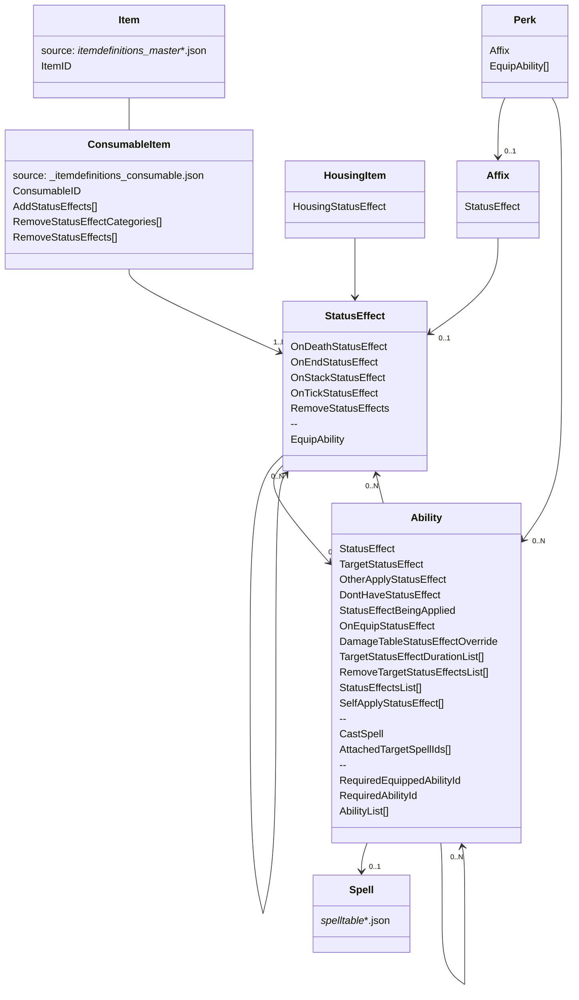

# Data table relations

```mermaid
classDiagram

    Item -- ConsumableItem
    
    ConsumableItem --> "1..N" StatusEffect

    HousingItem --> StatusEffect

    Perk --> "0..1" Affix
    Perk --> "0..N" Ability

    Affix --> "0..1" StatusEffect

    Ability --> "0..N" StatusEffect
    Ability --> "0..1" Spell
    Ability --> "0..N" Ability

    StatusEffect --> "0..N" StatusEffect
    StatusEffect --> "0..1" Ability

    class Item {
      source: _itemdefinitions_master_*.json
      ItemID
    }

    class ConsumableItem {
      source: _itemdefinitions_consumable.json
      ConsumableID
      AddStatusEffects[]
      RemoveStatusEffectCategories[]
      RemoveStatusEffects[]
    }

    class HousingItem {
      HousingStatusEffect
    }
    class Perk {
      Affix
      EquipAbility[]
    }

    class Affix {
      StatusEffect
    }

    class Ability {
      StatusEffect
      TargetStatusEffect
      OtherApplyStatusEffect
      DontHaveStatusEffect
      StatusEffectBeingApplied
      OnEquipStatusEffect
      DamageTableStatusEffectOverride
      TargetStatusEffectDurationList[]
      RemoveTargetStatusEffectsList[]
      StatusEffectsList[]
      SelfApplyStatusEffect[]
      --
      CastSpell
      AttachedTargetSpellIds[]
      --
      RequiredEquippedAbilityId
      RequiredAbilityId
      AbilityList[]
    }

    class StatusEffect {
      OnDeathStatusEffect
      OnEndStatusEffect
      OnStackStatusEffect
      OnTickStatusEffect
      RemoveStatusEffects
      --
      EquipAbility
    }

    class Spell {
      _spelltable_*.json
    }
```
